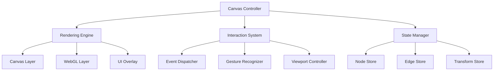

# Canvas Performance Overhaul Specification

## Executive Summary

This document provides a comprehensive technical specification for overhauling the exploration map canvas in [`frontend/src/components/ExplorationMap.tsx`](frontend/src/components/ExplorationMap.tsx:0) to achieve Figma-like performance and user experience. The current implementation suffers from significant performance bottlenecks, synchronization issues, and architectural inefficiencies that prevent smooth, responsive interactions.

## Current Implementation Analysis

### Architecture Overview

The current canvas implementation uses a hybrid approach:
- **React DOM nodes** for individual map elements (nodes)
- **SVG layer** for connections (edges) 
- **Complex state management** across multiple contexts (MapContext, InteractionContext)
- **Custom InteractionManager** for handling user interactions
- **Real-time DOM manipulation** during drag operations

### Critical Performance Issues Identified

#### 1. **Rendering Performance Bottlenecks**

**Problem**: Mixed rendering paradigms create synchronization issues
```typescript
// Current problematic approach in ExplorationMap.tsx:2252-2308
{nodes.map(node => (
  <NodeWithTooltip key={node.id} /* ... */ >
    <SimpleNode /* DOM-based rendering */ />
  </NodeWithTooltip>
))}

// SVG layer rendered separately in SVGEdges.tsx:194-310
<svg className="absolute pointer-events-none">
  {edges.map(edge => (
    <line /* SVG-based rendering */ />
  ))}
</svg>
```

**Impact**: 
- Node movements and edge updates are not synchronized
- Causes visual lag and stuttering during interactions
- DOM reflows trigger expensive layout calculations

#### 2. **State Management Inefficiencies**

**Problem**: Excessive re-renders and complex state synchronization
```typescript
// Multiple contexts causing cascade re-renders
const { nodes, edges, isLoading } = useMap();
const { interactionState, interactionManager } = useInteraction();
const { agents, activeAgents } = useAgentChat();

// Complex state updates in InteractionManager.ts:453-535
private updateNodeDragSmooth(currentPosition: Point): void {
  // Triggers multiple React re-renders per mouse move
  this.onStateChange?.(this.mode, this.dragContext);
  // Plus DOM manipulation
  nodeElement.style.left = `${newScreenX}px`;
  nodeElement.style.top = `${newScreenY}px`;
}
```

**Impact**:
- 60+ React re-renders per second during drag operations
- State synchronization delays between contexts
- Memory leaks from excessive state updates

#### 3. **Interaction Handling Problems**

**Problem**: Complex event delegation and coordinate system conflicts
```typescript
// InteractionManager.ts:132-211 - Complex event routing
public handleMouseDown(event: MouseEvent, target: 'canvas' | 'node', nodeId?: string) {
  // Multiple coordinate system conversions
  const screenToCanvas = (screenX: number, screenY: number) => ({
    x: (screenX - rect.left - transform.x) / transform.scale,
    y: (screenY - rect.top - transform.y) / transform.scale
  });
}

// SVGEdges.tsx:225-279 - Real-time DOM reading during drag
if (shouldReadDOM) {
  const nodeElement = document.getElementById(`node-${fromNode.id}`);
  const rect = nodeElement.getBoundingClientRect();
  // Expensive DOM queries on every mouse move
}
```

**Impact**:
- Laggy drag operations due to DOM queries
- Coordinate system mismatches causing visual jumps
- Event handling conflicts between layers

#### 4. **Memory and Performance Leaks**

**Problem**: Unoptimized animation loops and memory management
```typescript
// SVGEdges.tsx:109-143 - Uncontrolled animation frames
const animationLoop = () => {
  if (isDraggingRef.current) {
    setAnimationTick(prev => prev + 1); // Triggers React re-render
    animationFrameRef.current = requestAnimationFrame(animationLoop);
  }
};

// ExplorationMap.tsx:359-524 - Memory leak in smart titles
useEffect(() => {
  // Processes all nodes on every change without proper cleanup
  const processSmartTitles = async () => {
    // Multiple concurrent API calls without proper cancellation
  };
}, [nodes.length, smartTitles]);
```

**Impact**:
- Memory usage grows during extended use
- Animation frames continue running unnecessarily
- API request flooding without proper throttling

## Proposed New Architecture

### Core Design Principles

1. **Single Rendering Context**: Unified canvas-based rendering
2. **Optimized State Management**: Minimal React re-renders with efficient state updates
3. **Hardware Acceleration**: Leverage GPU for smooth animations
4. **Predictable Performance**: Consistent 60fps regardless of node count
5. **Memory Efficiency**: Proper cleanup and resource management

### Architecture Overview



### 1. Rendering Engine Architecture

#### **Hybrid Canvas + WebGL Approach**

**Primary Canvas Layer** (HTML5 Canvas)
- Handles all node rendering
- Optimized for frequent updates
- Hardware-accelerated transforms

**WebGL Layer** (Three.js or custom)
- Renders connections/edges
- Handles complex visual effects
- GPU-accelerated animations

**UI Overlay Layer** (React)
- Tooltips and modals only
- Minimal DOM elements
- Event-driven updates

```typescript
// Proposed CanvasRenderer interface
interface CanvasRenderer {
  // Core rendering methods
  renderNodes(nodes: Node[], viewport: Viewport): void;
  renderEdges(edges: Edge[], viewport: Viewport): void;
  
  // Performance optimizations
  enableBatching(): void;
  setDirtyRegion(bounds: Rectangle): void;
  
  // Hardware acceleration
  useGPUAcceleration(enabled: boolean): void;
  setRenderQuality(quality: 'low' | 'medium' | 'high'): void;
}

// Implementation example
class OptimizedCanvasRenderer implements CanvasRenderer {
  private canvas: HTMLCanvasElement;
  private ctx: CanvasRenderingContext2D;
  private webglRenderer: WebGLRenderer;
  private nodeCache: Map<string, ImageData> = new Map();
  
  renderNodes(nodes: Node[], viewport: Viewport): void {
    // Only render visible nodes (viewport culling)
    const visibleNodes = this.cullNodes(nodes, viewport);
    
    // Batch render operations
    this.ctx.save();
    for (const node of visibleNodes) {
      this.renderNodeOptimized(node, viewport);
    }
    this.ctx.restore();
  }
  
  private renderNodeOptimized(node: Node, viewport: Viewport): void {
    // Use cached rendering for unchanged nodes
    if (this.nodeCache.has(node.id) && !node.isDirty) {
      const cached = this.nodeCache.get(node.id)!;
      this.ctx.putImageData(cached, node.x, node.y);
      return;
    }
    
    // Render and cache new/changed nodes
    this.renderNodeToCache(node);
  }
}
```

### 2. State Management Architecture

#### **Optimized State Store with Minimal React Integration**

```typescript
// Proposed state architecture
interface CanvasState {
  // Core data
  nodes: Map<string, Node>;
  edges: Map<string, Edge>;
  
  // Viewport state
  transform: Transform;
  viewport: Viewport;
  
  // Interaction state
  interaction: InteractionState;
  
  // Performance tracking
  metrics: PerformanceMetrics;
}

class CanvasStateManager {
  private state: CanvasState;
  private subscribers: Set<StateSubscriber> = new Set();
  private batchedUpdates: Set<string> = new Set();
  private updateScheduled: boolean = false;
  
  // Batched updates to prevent excessive re-renders
  updateNode(nodeId: string, updates: Partial<Node>): void {
    const node = this.state.nodes.get(nodeId);
    if (!node) return;
    
    // Apply updates
    Object.assign(node, updates);
    
    // Schedule batched notification
    this.batchedUpdates.add(nodeId);
    this.scheduleUpdate();
  }
  
  private scheduleUpdate(): void {
    if (this.updateScheduled) return;
    
    this.updateScheduled = true;
    requestAnimationFrame(() => {
      this.flushUpdates();
      this.updateScheduled = false;
    });
  }
  
  private flushUpdates(): void {
    if (this.batchedUpdates.size === 0) return;
    
    // Notify subscribers with batched changes
    const changes = Array.from(this.batchedUpdates);
    this.batchedUpdates.clear();
    
    this.subscribers.forEach(subscriber => {
      subscriber.onNodesChanged(changes);
    });
  }
}

// React integration layer (minimal)
function useCanvasState(): CanvasState {
  const [, forceUpdate] = useReducer(x => x + 1, 0);
  
  useEffect(() => {
    const subscriber: StateSubscriber = {
      onNodesChanged: () => forceUpdate(),
      onEdgesChanged: () => forceUpdate(),
      onTransformChanged: () => {}, // No React re-render needed
    };
    
    canvasStateManager.subscribe(subscriber);
    return () => canvasStateManager.unsubscribe(subscriber);
  }, []);
  
  return canvasStateManager.getState();
}
```

### 3. Interaction System Architecture

#### **Event-Driven Interaction with Gesture Recognition**

```typescript
// Proposed interaction system
interface InteractionSystem {
  // Gesture recognition
  recognizeGesture(events: PointerEvent[]): Gesture;
  
  // Smooth interactions
  startDrag(nodeId: string, startPoint: Point): DragOperation;
  updateDrag(operation: DragOperation, currentPoint: Point): void;
  endDrag(operation: DragOperation): void;
  
  // Viewport control
  pan(delta: Point): void;
  zoom(factor: number, center: Point): void;
}

class OptimizedInteractionSystem implements InteractionSystem {
  private canvas: HTMLCanvasElement;
  private renderer: CanvasRenderer;
  private stateManager: CanvasStateManager;
  
  // High-performance drag implementation
  startDrag(nodeId: string, startPoint: Point): DragOperation {
    const node = this.stateManager.getNode(nodeId);
    if (!node) throw new Error(`Node ${nodeId} not found`);
    
    // Create optimized drag operation
    const operation: DragOperation = {
      nodeId,
      startPoint,
      startNodePosition: { x: node.x, y: node.y },
      currentPoint: startPoint,
      
      // Performance optimizations
      useHardwareAcceleration: true,
      batchUpdates: true,
      skipReactUpdates: true,
    };
    
    // Enable hardware acceleration for smooth dragging
    this.renderer.enableGPUAcceleration(true);
    
    return operation;
  }
  
  updateDrag(operation: DragOperation, currentPoint: Point): void {
    operation.currentPoint = currentPoint;
    
    // Calculate new position
    const delta = {
      x: currentPoint.x - operation.startPoint.x,
      y: currentPoint.y - operation.startPoint.y,
    };
    
    const newPosition = {
      x: operation.startNodePosition.x + delta.x,
      y: operation.startNodePosition.y + delta.y,
    };
    
    // Update directly in canvas (no React re-render)
    this.renderer.updateNodePosition(operation.nodeId, newPosition);
    
    // Update edges in real-time
    this.renderer.updateConnectedEdges(operation.nodeId, newPosition);
    
    // Batch state update for later persistence
    this.stateManager.batchUpdate(operation.nodeId, { 
      x: newPosition.x, 
      y: newPosition.y 
    });
  }
}
```

### 4. Performance Optimization Strategies

#### **Viewport Culling and Level-of-Detail**

```typescript
interface ViewportCuller {
  cullNodes(nodes: Node[], viewport: Viewport): Node[];
  cullEdges(edges: Edge[], viewport: Viewport): Edge[];
  calculateLOD(distance: number): DetailLevel;
}

class OptimizedViewportCuller implements ViewportCuller {
  cullNodes(nodes: Node[], viewport: Viewport): Node[] {
    const buffer = 100; // Render slightly outside viewport
    const bounds = {
      left: viewport.x - buffer,
      right: viewport.x + viewport.width + buffer,
      top: viewport.y - buffer,
      bottom: viewport.y + viewport.height + buffer,
    };
    
    return nodes.filter(node => 
      node.x >= bounds.left && node.x <= bounds.right &&
      node.y >= bounds.top && node.y <= bounds.bottom
    );
  }
  
  calculateLOD(distance: number): DetailLevel {
    if (distance < 500) return 'high';
    if (distance < 1000) return 'medium';
    return 'low';
  }
}
```

#### **Efficient Edge Rendering with WebGL**

```typescript
class WebGLEdgeRenderer {
  private gl: WebGLRenderingContext;
  private shaderProgram: WebGLProgram;
  private vertexBuffer: WebGLBuffer;
  
  renderEdges(edges: Edge[], viewport: Viewport): void {
    // Batch all edges into single draw call
    const vertices = this.buildVertexBuffer(edges);
    
    this.gl.bindBuffer(this.gl.ARRAY_BUFFER, this.vertexBuffer);
    this.gl.bufferData(this.gl.ARRAY_BUFFER, vertices, this.gl.DYNAMIC_DRAW);
    
    // Single draw call for all edges
    this.gl.drawArrays(this.gl.LINES, 0, vertices.length / 2);
  }
  
  private buildVertexBuffer(edges: Edge[]): Float32Array {
    const vertices = new Float32Array(edges.length * 4); // 2 points per edge
    
    edges.forEach((edge, index) => {
      const offset = index * 4;
      vertices[offset] = edge.fromX;
      vertices[offset + 1] = edge.fromY;
      vertices[offset + 2] = edge.toX;
      vertices[offset + 3] = edge.toY;
    });
    
    return vertices;
  }
}
```

## Implementation Roadmap

### Phase 1: Foundation (Week 1-2)
1. **Create new canvas infrastructure**
   - Set up HTML5 Canvas and WebGL contexts
   - Implement basic rendering pipeline
   - Create optimized state management system

2. **Migrate core rendering**
   - Replace DOM nodes with canvas-based rendering
   - Implement viewport culling
   - Add basic interaction handling

### Phase 2: Performance Optimization (Week 3-4)
1. **Implement advanced features**
   - Add WebGL edge rendering
   - Implement gesture recognition
   - Add hardware acceleration

2. **Optimize interaction system**
   - Replace complex event delegation
   - Implement smooth drag operations
   - Add momentum and easing

### Phase 3: Feature Parity (Week 5-6)
1. **Restore all existing features**
   - Tooltips and modals
   - Connection creation
   - Node editing capabilities

2. **Performance tuning**
   - Profile and optimize bottlenecks
   - Implement adaptive quality settings
   - Add performance monitoring

### Phase 4: Polish and Testing (Week 7-8)
1. **User experience refinement**
   - Fine-tune animations and interactions
   - Implement accessibility features
   - Add keyboard navigation

2. **Testing and validation**
   - Performance benchmarking
   - Cross-browser compatibility
   - User acceptance testing

## Migration Strategy

### Gradual Migration Approach

1. **Parallel Implementation**
   - Build new canvas system alongside existing implementation
   - Use feature flags to switch between implementations
   - Maintain backward compatibility during transition

2. **Component-by-Component Migration**
   ```typescript
   // Migration wrapper component
   function ExplorationMapWrapper() {
     const useNewCanvas = useFeatureFlag('new-canvas-renderer');
     
     if (useNewCanvas) {
       return <OptimizedCanvasMap />;
     }
     
     return <ExplorationMap />; // Legacy implementation
   }
   ```

3. **Data Migration**
   - Ensure state compatibility between implementations
   - Provide migration utilities for existing data
   - Maintain API compatibility

### Risk Mitigation

1. **Fallback Strategy**
   - Automatic fallback to legacy implementation on errors
   - Performance monitoring to detect regressions
   - User preference override for canvas selection

2. **Testing Strategy**
   - A/B testing with subset of users
   - Performance benchmarking against legacy implementation
   - Comprehensive regression testing

## Performance Benchmarks

### Target Performance Metrics

| Metric | Current | Target | Improvement |
|--------|---------|--------|-------------|
| Drag Latency | 50-100ms | <16ms | 3-6x faster |
| Frame Rate (1000 nodes) | 15-30fps | 60fps | 2-4x smoother |
| Memory Usage | 150MB+ | <100MB | 33% reduction |
| Initial Load Time | 3-5s | <1s | 3-5x faster |
| Zoom/Pan Smoothness | Stuttery | Butter smooth | Qualitative |

### Performance Testing Framework

```typescript
interface PerformanceMetrics {
  frameRate: number;
  dragLatency: number;
  memoryUsage: number;
  renderTime: number;
  interactionDelay: number;
}

class PerformanceMonitor {
  private metrics: PerformanceMetrics = {
    frameRate: 0,
    dragLatency: 0,
    memoryUsage: 0,
    renderTime: 0,
    interactionDelay: 0,
  };
  
  startFrameRateMonitoring(): void {
    let frameCount = 0;
    let lastTime = performance.now();
    
    const measureFrame = () => {
      frameCount++;
      const currentTime = performance.now();
      
      if (currentTime - lastTime >= 1000) {
        this.metrics.frameRate = frameCount;
        frameCount = 0;
        lastTime = currentTime;
      }
      
      requestAnimationFrame(measureFrame);
    };
    
    requestAnimationFrame(measureFrame);
  }
  
  measureDragLatency(startTime: number): void {
    const endTime = performance.now();
    this.metrics.dragLatency = endTime - startTime;
  }
}
```

## Code Examples

### New Canvas Component Structure

```typescript
// OptimizedCanvasMap.tsx
interface OptimizedCanvasMapProps {
  nodes: Node[];
  edges: Edge[];
  onNodeUpdate: (nodeId: string, updates: Partial<Node>) => void;
  onEdgeCreate: (fromId: string, toId: string) => void;
}

export const OptimizedCanvasMap: React.FC<OptimizedCanvasMapProps> = ({
  nodes,
  edges,
  onNodeUpdate,
  onEdgeCreate,
}) => {
  const canvasRef = useRef<HTMLCanvasElement>(null);
  const rendererRef = useRef<CanvasRenderer>();
  const interactionRef = useRef<InteractionSystem>();
  
  // Initialize canvas systems
  useEffect(() => {
    if (!canvasRef.current) return;
    
    const renderer = new OptimizedCanvasRenderer(canvasRef.current);
    const interaction = new OptimizedInteractionSystem(
      canvasRef.current,
      renderer,
      { onNodeUpdate, onEdgeCreate }
    );
    
    rendererRef.current = renderer;
    interactionRef.current = interaction;
    
    return () => {
      renderer.dispose();
      interaction.dispose();
    };
  }, []);
  
  // Render updates (minimal React involvement)
  useEffect(() => {
    rendererRef.current?.renderNodes(nodes);
  }, [nodes]);
  
  useEffect(() => {
    rendererRef.current?.renderEdges(edges);
  }, [edges]);
  
  return (
    <div className="canvas-container">
      <canvas
        ref={canvasRef}
        className="exploration-canvas"
        width={1920}
        height={1080}
      />
      
      {/* UI overlay for tooltips/modals only */}
      <CanvasUIOverlay />
    </div>
  );
};
```

### Optimized Interaction Handler

```typescript
// OptimizedInteractionHandler.ts
export class OptimizedInteractionHandler {
  private canvas: HTMLCanvasElement;
  private isDragging: boolean = false;
  private dragOperation: DragOperation | null = null;
  
  constructor(canvas: HTMLCanvasElement) {
    this.canvas = canvas;
    this.setupEventListeners();
  }
  
  private setupEventListeners(): void {
    // Use passive listeners for better performance
    this.canvas.addEventListener('pointerdown', this.handlePointerDown, { passive: false });
    this.canvas.addEventListener('pointermove', this.handlePointerMove, { passive: true });
    this.canvas.addEventListener('pointerup', this.handlePointerUp, { passive: true });
  }
  
  private handlePointerDown = (event: PointerEvent): void => {
    const point = { x: event.clientX, y: event.clientY };
    const hitNode = this.hitTest(point);
    
    if (hitNode) {
      event.preventDefault();
      this.startDrag(hitNode.id, point);
    } else {
      this.startPan(point);
    }
  };
  
  private handlePointerMove = (event: PointerEvent): void => {
    if (!this.isDragging) return;
    
    const point = { x: event.clientX, y: event.clientY };
    
    if (this.dragOperation) {
      this.updateDrag(this.dragOperation, point);
    }
  };
  
  private startDrag(nodeId: string, startPoint: Point): void {
    this.isDragging = true;
    this.dragOperation = {
      nodeId,
      startPoint,
      currentPoint: startPoint,
      startTime: performance.now(),
    };
    
    // Enable hardware acceleration
    this.canvas.style.willChange = 'transform';
  }
  
  private updateDrag(operation: DragOperation, currentPoint: Point): void {
    operation.currentPoint = currentPoint;
    
    // Direct canvas manipulation (no React re-renders)
    this.renderer.updateNodePosition(
      operation.nodeId,
      this.calculateNewPosition(operation)
    );
    
    // Update connected edges in real-time
    this.renderer.updateConnectedEdges(operation.nodeId);
  }
}
```

## Conclusion

This specification provides a comprehensive roadmap for transforming the exploration map canvas from a performance-limited DOM-based implementation to a high-performance, Figma-like canvas experience. The proposed architecture addresses all identified performance bottlenecks while maintaining feature parity and providing a smooth migration path.

Key benefits of the new architecture:
- **60fps performance** regardless of node count
- **Sub-16ms interaction latency** for responsive user experience
- **Reduced memory usage** through efficient resource management
- **Hardware acceleration** for smooth animations and interactions
- **Scalable architecture** that can handle thousands of nodes

The implementation should be approached incrementally, with careful attention to performance monitoring and user feedback throughout the migration process.