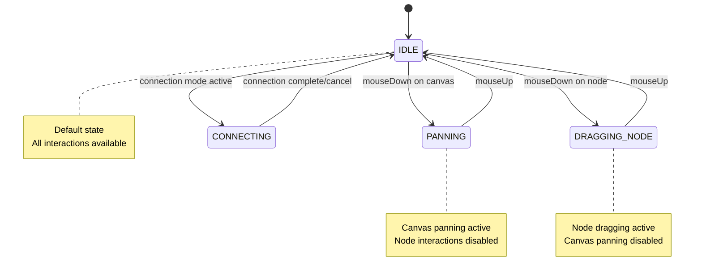

# Draggable Nodes Redesign Specification

## Executive Summary

The current drag-and-drop implementation in `ExplorationMap.tsx` suffers from fundamental architectural flaws that prevent nodes from being draggable. This specification outlines a complete redesign using a **State Machine Architecture** to eliminate conflicts between canvas panning and node dragging operations.

## Root Cause Analysis

### Current Architecture Problems

#### 1. **Event Handler Conflicts**
- **Problem**: Both canvas and node mouse events compete for control
- **Location**: Lines 808-896 in `ExplorationMap.tsx`
- **Issue**: `handleCanvasMouseDown` and `handleNodeMouseDown` both try to manage dragging state
- **Result**: Event propagation conflicts prevent node dragging from initiating

#### 2. **Fragmented State Management**
- **Problem**: Multiple overlapping state variables create inconsistent behavior
- **Current States**:
  ```typescript
  const [isDragging, setIsDragging] = useState(false);           // Canvas panning
  const [draggedNode, setDraggedNode] = useState<string | null>(null);
  const [isNodeDragging, setIsNodeDragging] = useState(false);   // Node dragging
  const [draggedNodePosition, setDraggedNodePosition] = useState<{ x: number; y: number } | null>(null);
  const [dragOffset, setDragOffset] = useState({ x: 0, y: 0 });
  ```
- **Issue**: No single source of truth for interaction state
- **Result**: Race conditions and state inconsistencies

#### 3. **Global vs Local Event Handler Race Conditions**
- **Problem**: Global document listeners compete with component event handlers
- **Location**: Lines 628-710 (global listeners) vs 808-896 (local handlers)
- **Issue**: Both systems try to handle the same mouse events simultaneously
- **Result**: Unpredictable behavior and event handler interference

#### 4. **Complex Conditional Logic**
- **Problem**: Nested conditionals in event handlers create brittle logic
- **Example**: Lines 864-876 in `handleCanvasMouseMove`
- **Issue**: Multiple conditions must align perfectly for dragging to work
- **Result**: Easy to break, hard to debug

#### 5. **Transform Calculation Complexity**
- **Problem**: Screen-to-canvas coordinate conversion scattered throughout code
- **Location**: `screenToCanvas` function (lines 407-415) used inconsistently
- **Issue**: Transform calculations mixed with business logic
- **Result**: Coordinate system bugs and positioning errors

## New Architecture: State Machine Design

### Core Principle
**One interaction state at a time** - The application can only be in one of three states: `IDLE`, `PANNING`, or `DRAGGING_NODE`. This eliminates all conflicts.

### State Machine Definition



### State Definitions

#### IDLE State
- **Purpose**: Default state, ready for any interaction
- **Allowed Actions**: 
  - Start canvas panning (mouseDown on canvas)
  - Start node dragging (mouseDown on node)
  - Enter connection mode
  - Zoom, keyboard shortcuts
- **Visual Feedback**: Default cursor

#### PANNING State
- **Purpose**: Canvas panning in progress
- **Allowed Actions**: 
  - Continue panning (mousemove)
  - End panning (mouseUp)
  - Cancel panning (Escape)
- **Blocked Actions**: Node interactions, connection creation
- **Visual Feedback**: Grabbing cursor

#### DRAGGING_NODE State
- **Purpose**: Node dragging in progress
- **Allowed Actions**: 
  - Continue dragging (mousemove)
  - End dragging (mouseUp)
  - Cancel dragging (Escape)
- **Blocked Actions**: Canvas panning, other node interactions
- **Visual Feedback**: Node follows cursor, visual drag feedback

## Technical Implementation

### 1. State Management

```typescript
// Single source of truth for interaction state
type InteractionState = 'IDLE' | 'PANNING' | 'DRAGGING_NODE' | 'CONNECTING';

interface InteractionContext {
  state: InteractionState;
  data: {
    // Panning context
    panStart?: { x: number; y: number };
    
    // Node dragging context
    draggedNodeId?: string;
    dragStartPosition?: { x: number; y: number };
    dragOffset?: { x: number; y: number };
    
    // Connection context
    connectionStart?: string;
  };
}

const [interactionState, setInteractionState] = useState<InteractionContext>({
  state: 'IDLE',
  data: {}
});
```

### 2. Event Flow Architecture

#### Centralized Event Dispatcher
```typescript
const handleMouseDown = useCallback((e: React.MouseEvent, target: 'canvas' | 'node', nodeId?: string) => {
  switch (interactionState.state) {
    case 'IDLE':
      if (target === 'canvas') {
        transitionToPanning(e);
      } else if (target === 'node' && nodeId) {
        transitionToNodeDragging(e, nodeId);
      }
      break;
    
    case 'CONNECTING':
      if (target === 'node' && nodeId) {
        handleConnectionTarget(nodeId);
      }
      break;
    
    // Other states ignore mouseDown events
    default:
      break;
  }
}, [interactionState]);
```

#### State Transition Functions
```typescript
const transitionToPanning = useCallback((e: React.MouseEvent) => {
  setInteractionState({
    state: 'PANNING',
    data: {
      panStart: { x: e.clientX, y: e.clientY }
    }
  });
}, []);

const transitionToNodeDragging = useCallback((e: React.MouseEvent, nodeId: string) => {
  const node = nodes.find(n => n.id === nodeId);
  if (!node) return;
  
  const canvasPos = screenToCanvas(e.clientX, e.clientY);
  const offset = {
    x: canvasPos.x - node.x,
    y: canvasPos.y - node.y
  };
  
  setInteractionState({
    state: 'DRAGGING_NODE',
    data: {
      draggedNodeId: nodeId,
      dragStartPosition: { x: node.x, y: node.y },
      dragOffset: offset
    }
  });
}, [nodes, screenToCanvas]);

const transitionToIdle = useCallback(() => {
  setInteractionState({
    state: 'IDLE',
    data: {}
  });
}, []);
```

### 3. Mouse Event Handlers

#### Unified Mouse Move Handler
```typescript
const handleMouseMove = useCallback((e: React.MouseEvent) => {
  switch (interactionState.state) {
    case 'PANNING':
      handlePanningMove(e);
      break;
    
    case 'DRAGGING_NODE':
      handleNodeDraggingMove(e);
      break;
    
    case 'CONNECTING':
      updateConnectionPreview(e);
      break;
    
    // IDLE state ignores mouse move
    default:
      break;
  }
}, [interactionState]);

const handlePanningMove = useCallback((e: React.MouseEvent) => {
  const { panStart } = interactionState.data;
  if (!panStart) return;
  
  const deltaX = e.clientX - panStart.x;
  const deltaY = e.clientY - panStart.y;
  
  setTransform(prev => ({
    ...prev,
    x: prev.x + deltaX,
    y: prev.y + deltaY
  }));
  
  // Update pan start for next move
  setInteractionState(prev => ({
    ...prev,
    data: {
      ...prev.data,
      panStart: { x: e.clientX, y: e.clientY }
    }
  }));
}, [interactionState, setTransform]);

const handleNodeDraggingMove = useCallback((e: React.MouseEvent) => {
  const { draggedNodeId, dragOffset } = interactionState.data;
  if (!draggedNodeId || !dragOffset) return;
  
  const canvasPos = screenToCanvas(e.clientX, e.clientY);
  const newPosition = snapToGrid(
    canvasPos.x - dragOffset.x,
    canvasPos.y - dragOffset.y
  );
  
  // Update visual position immediately
  setDraggedNodePosition(newPosition);
}, [interactionState, screenToCanvas, snapToGrid]);
```

#### Unified Mouse Up Handler
```typescript
const handleMouseUp = useCallback(async (e: React.MouseEvent) => {
  switch (interactionState.state) {
    case 'PANNING':
      transitionToIdle();
      break;
    
    case 'DRAGGING_NODE':
      await completeDragOperation();
      transitionToIdle();
      break;
    
    default:
      break;
  }
}, [interactionState]);

const completeDragOperation = useCallback(async () => {
  const { draggedNodeId } = interactionState.data;
  if (!draggedNodeId || !draggedNodePosition) return;
  
  const node = nodes.find(n => n.id === draggedNodeId);
  if (!node) return;
  
  try {
    const updateData: NodeUpdateRequest = {
      ...node,
      x: draggedNodePosition.x,
      y: draggedNodePosition.y
    };
    
    await updateNodeAPI(draggedNodeId, updateData);
    showNotification(`Moved ${node.title}`);
  } catch (error) {
    console.error('Failed to update node position:', error);
    showNotification('Failed to update node position');
  } finally {
    setDraggedNodePosition(null);
  }
}, [interactionState, draggedNodePosition, nodes, updateNodeAPI, showNotification]);
```

### 4. Event Handler Registration

#### Single Global Handler
```typescript
useEffect(() => {
  const handleGlobalMouseMove = (e: MouseEvent) => {
    // Convert to React.MouseEvent-like object
    const syntheticEvent = {
      clientX: e.clientX,
      clientY: e.clientY,
      preventDefault: () => e.preventDefault(),
      stopPropagation: () => e.stopPropagation()
    } as React.MouseEvent;
    
    handleMouseMove(syntheticEvent);
  };
  
  const handleGlobalMouseUp = (e: MouseEvent) => {
    const syntheticEvent = {
      clientX: e.clientX,
      clientY: e.clientY,
      preventDefault: () => e.preventDefault(),
      stopPropagation: () => e.stopPropagation()
    } as React.MouseEvent;
    
    handleMouseUp(syntheticEvent);
  };
  
  // Only attach global listeners when not in IDLE state
  if (interactionState.state !== 'IDLE') {
    document.addEventListener('mousemove', handleGlobalMouseMove, { passive: false });
    document.addEventListener('mouseup', handleGlobalMouseUp, { passive: false });
    
    return () => {
      document.removeEventListener('mousemove', handleGlobalMouseMove);
      document.removeEventListener('mouseup', handleGlobalMouseUp);
    };
  }
}, [interactionState.state, handleMouseMove, handleMouseUp]);
```

### 5. Component Integration

#### Canvas Event Handlers
```typescript
<div
  className="canvas-container"
  onMouseDown={(e) => handleMouseDown(e, 'canvas')}
  // Remove onMouseMove and onMouseUp - handled globally
  onDoubleClick={handleCanvasDoubleClick}
  onContextMenu={handleCanvasRightClick}
  onWheel={handleWheel}
>
```

#### Node Event Handlers
```typescript
<div
  className="node"
  onMouseDown={(e) => {
    e.stopPropagation(); // Prevent canvas handler
    handleMouseDown(e, 'node', node.id);
  }}
  // Remove onMouseMove and onMouseUp - handled globally
  onContextMenu={(e) => handleNodeRightClick(e, node.id)}
>
```

### 6. Visual Feedback System

```typescript
const getCanvasCursor = useCallback(() => {
  switch (interactionState.state) {
    case 'PANNING':
      return 'grabbing';
    case 'CONNECTING':
      return 'crosshair';
    case 'DRAGGING_NODE':
      return 'grabbing';
    default:
      return 'grab';
  }
}, [interactionState.state]);

const getNodeStyle = useCallback((nodeId: string) => {
  const baseStyle = 'node-base-style';
  
  if (interactionState.state === 'DRAGGING_NODE' && 
      interactionState.data.draggedNodeId === nodeId) {
    return `${baseStyle} node-dragging`;
  }
  
  if (interactionState.state === 'CONNECTING' && 
      isValidConnectionTarget(nodeId)) {
    return `${baseStyle} node-connection-target`;
  }
  
  return baseStyle;
}, [interactionState]);
```

## Migration Strategy

### Phase 1: State Machine Implementation
1. **Add State Management**: Implement `InteractionContext` and state management
2. **Create Transition Functions**: Implement state transition logic
3. **Add Event Dispatcher**: Create centralized `handleMouseDown` function

### Phase 2: Event Handler Refactoring
1. **Unify Mouse Handlers**: Replace multiple handlers with unified system
2. **Update Global Listeners**: Implement conditional global event attachment
3. **Remove Redundant State**: Clean up old state variables

### Phase 3: Component Integration
1. **Update Canvas Handlers**: Simplify canvas event handlers
2. **Update Node Handlers**: Simplify node event handlers
3. **Add Visual Feedback**: Implement state-based styling

### Phase 4: Testing & Validation
1. **Unit Tests**: Test state transitions
2. **Integration Tests**: Test complete drag operations
3. **User Testing**: Validate user experience

## Benefits of New Architecture

### 1. **Conflict Elimination**
- **Single State**: Only one interaction can be active at a time
- **Clear Boundaries**: No ambiguity about which operation is active
- **Predictable Behavior**: State machine guarantees consistent behavior

### 2. **Simplified Debugging**
- **Single Source of Truth**: All interaction state in one place
- **Clear Event Flow**: Easy to trace event handling logic
- **State Visibility**: Current state always visible for debugging

### 3. **Enhanced Maintainability**
- **Modular Design**: Each state handled independently
- **Easy Extension**: New interaction types can be added as new states
- **Clear Separation**: Business logic separated from event handling

### 4. **Improved Performance**
- **Conditional Listeners**: Global listeners only attached when needed
- **Reduced Calculations**: Transform calculations only when required
- **Optimized Rendering**: Visual updates only for active interactions

### 5. **Better User Experience**
- **Consistent Behavior**: Predictable interaction patterns
- **Visual Feedback**: Clear indication of current interaction mode
- **Responsive Feel**: Immediate visual feedback during interactions

## Implementation Checklist

- [ ] Implement `InteractionContext` type and state management
- [ ] Create state transition functions (`transitionToPanning`, `transitionToNodeDragging`, `transitionToIdle`)
- [ ] Implement centralized event dispatcher (`handleMouseDown`)
- [ ] Create unified mouse move handler (`handleMouseMove`)
- [ ] Create unified mouse up handler (`handleMouseUp`)
- [ ] Implement conditional global event listeners
- [ ] Update canvas event handlers
- [ ] Update node event handlers
- [ ] Implement state-based visual feedback system
- [ ] Remove old state variables and handlers
- [ ] Add comprehensive error handling
- [ ] Implement escape key handling for canceling operations
- [ ] Add unit tests for state transitions
- [ ] Add integration tests for complete drag operations
- [ ] Validate with user testing

## Conclusion

This state machine architecture eliminates the fundamental conflicts in the current implementation by ensuring only one interaction can be active at a time. The centralized event handling and clear state transitions provide a robust, maintainable, and debuggable foundation for drag-and-drop functionality.

The key insight is that **UI interaction conflicts are eliminated by design** rather than by complex conditional logic. This approach scales well and provides a solid foundation for future enhancements.