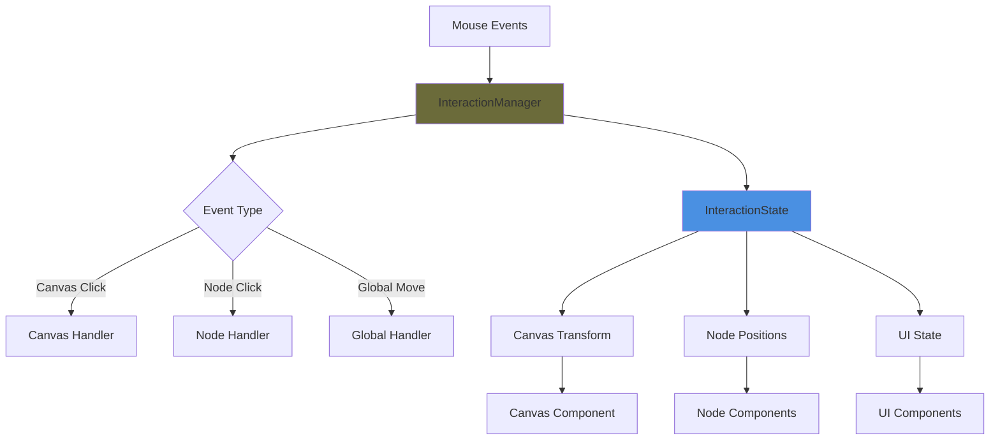
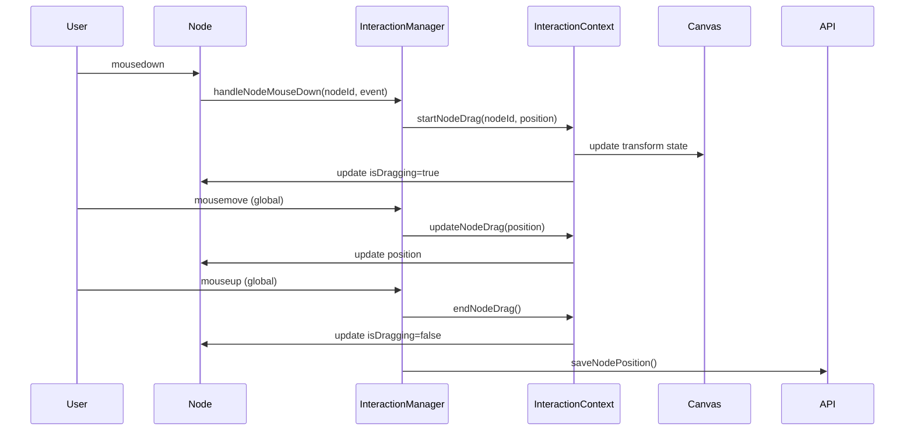

# Node Dragging Architecture Redesign

## Problem Analysis

After extensive debugging attempts by multiple specialized modes, the node dragging issue persists due to fundamental architectural conflicts in the current interaction system. The root causes are:

### 1. **Dual Event Handling Systems**
- **DraggableNode Component**: Self-contained dragging logic with its own state management
- **ExplorationMap Canvas**: Global interaction state management via InteractionContext
- **Conflict**: Both systems compete for the same mouse events, causing interference

### 2. **Event Propagation Conflicts**
- Canvas-level mouse handlers intercept events intended for nodes
- `handleCanvasMouseDown` attempts to detect node clicks but fails due to complex DOM structure
- Event prevention/propagation logic is inconsistent between systems

### 3. **State Management Fragmentation**
- Node dragging state exists in three places:
  - DraggableNode local state (`isDragging`, `dragStart`, `dragOffset`)
  - InteractionContext global state (`DRAGGING_NODE` state)
  - ExplorationMap component state (`selectedNode`, `focusedNode`)

### 4. **Coordinate System Confusion**
- Multiple coordinate transformations between screen, canvas, and node coordinates
- Transform calculations scattered across different components
- Inconsistent handling of zoom/pan transforms during dragging

## Architectural Solution: Unified Interaction Manager

### Core Design Principles

1. **Single Source of Truth**: One centralized interaction manager
2. **Clear Event Ownership**: Explicit event handling hierarchy
3. **Predictable State Flow**: Unidirectional data flow for all interactions
4. **Separation of Concerns**: UI rendering separate from interaction logic

### New Architecture Overview



### Component Architecture

#### 1. **InteractionManager** (New Core Component)
```typescript
interface InteractionManager {
  // State
  currentState: InteractionState
  activeNode: string | null
  dragContext: DragContext | null
  
  // Event Handlers
  handleMouseDown(event: MouseEvent, target: EventTarget): void
  handleMouseMove(event: MouseEvent): void
  handleMouseUp(event: MouseEvent): void
  
  // State Transitions
  startNodeDrag(nodeId: string, startPos: Point): void
  updateNodeDrag(currentPos: Point): void
  endNodeDrag(): void
  startCanvasPan(startPos: Point): void
  // ... other transitions
}
```

#### 2. **Enhanced InteractionContext**
```typescript
interface InteractionState {
  mode: 'IDLE' | 'DRAGGING_NODE' | 'PANNING' | 'CONNECTING'
  activeNodeId: string | null
  dragData: {
    startPosition: Point
    currentPosition: Point
    offset: Point
  } | null
  panData: {
    startPosition: Point
    currentTransform: Transform
  } | null
}
```

#### 3. **Simplified Node Component**
```typescript
interface SimpleNode {
  // Props only - no internal state
  node: Node
  transform: Transform
  isActive: boolean
  isDragging: boolean
  
  // Event callbacks only
  onMouseDown: (nodeId: string, event: MouseEvent) => void
}
```

### Event Flow Design

#### Node Dragging Flow


### Implementation Strategy

#### Phase 1: Create New InteractionManager
1. **New File**: `frontend/src/managers/InteractionManager.ts`
2. **Centralized Logic**: All mouse event handling in one place
3. **Clear Interfaces**: Well-defined contracts for all interactions

#### Phase 2: Enhance InteractionContext
1. **Expanded State**: More detailed interaction state management
2. **Better Transitions**: Cleaner state transition functions
3. **Event Coordination**: Coordinate between manager and context

#### Phase 3: Simplify Components
1. **Stateless Nodes**: Remove all internal state from node components
2. **Pure Rendering**: Nodes only render based on props
3. **Event Delegation**: All events flow through InteractionManager

#### Phase 4: Unified Event System
1. **Single Event Root**: All mouse events captured at canvas level
2. **Smart Routing**: Route events to appropriate handlers
3. **Consistent Prevention**: Unified event prevention strategy

### Key Benefits

1. **Eliminates Conflicts**: Single event handling system prevents interference
2. **Predictable Behavior**: Clear state management makes debugging easier
3. **Better Performance**: Reduced event listener overhead
4. **Maintainable Code**: Centralized logic is easier to modify and extend
5. **Extensible Design**: Easy to add new interaction types

### Migration Plan

#### Step 1: Implement InteractionManager
- Create new InteractionManager class
- Implement core event handling logic
- Add comprehensive logging for debugging

#### Step 2: Update InteractionContext
- Expand state interface
- Add new transition methods
- Maintain backward compatibility

#### Step 3: Refactor ExplorationMap
- Remove duplicate event handlers
- Integrate with InteractionManager
- Simplify mouse event logic

#### Step 4: Simplify DraggableNode
- Remove internal state management
- Convert to pure component
- Use props for all state

#### Step 5: Testing & Validation
- Comprehensive interaction testing
- Performance validation
- Regression testing for other features

### Risk Mitigation

1. **Gradual Migration**: Implement changes incrementally
2. **Feature Flags**: Use flags to switch between old/new systems
3. **Comprehensive Testing**: Test all interaction scenarios
4. **Rollback Plan**: Keep old system available for quick rollback

### Success Metrics

1. **Functional**: All nodes are consistently draggable
2. **Performance**: No degradation in interaction responsiveness
3. **Maintainability**: Reduced code complexity and duplication
4. **Extensibility**: Easy to add new interaction features

## Implementation Priority

This architectural redesign should be implemented immediately as the current system has proven resistant to surgical fixes. The fundamental design conflicts require a comprehensive solution rather than continued patching.

The new architecture will provide a solid foundation for reliable node dragging and future interaction features.