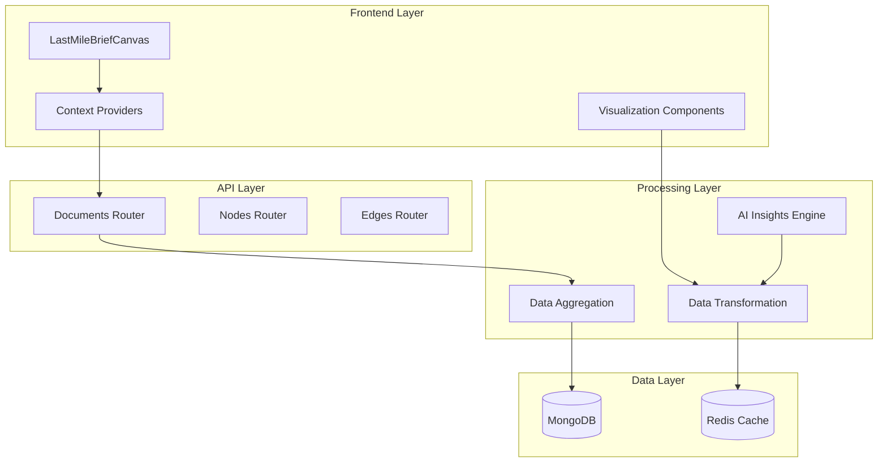
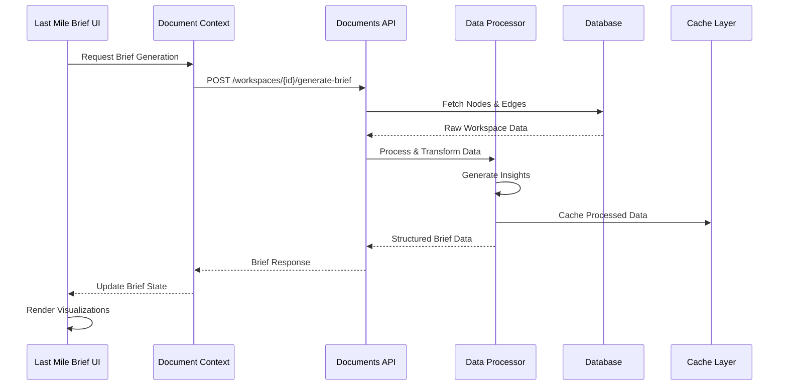
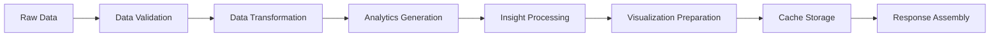

# Last Mile Brief - Technical Architecture Specification

## Executive Summary

This document defines the technical architecture for the Last Mile Brief canvas, a real-time reporting system that extracts and transforms data from the Exploration Map into visually compelling insights. The architecture emphasizes performance, scalability, and maintainability while delivering luxury-grade user experiences.

## 1. System Architecture Overview

### 1.1 High-Level Architecture



### 1.2 Data Flow Architecture



## 2. Component Architecture

### 2.1 Core Component Hierarchy

```
LastMileBriefCanvas/
├── BriefHeader/
│   ├── BriefTitle
│   ├── BriefMetadata
│   └── BriefActions
├── ExecutiveSummary/
│   ├── KeyMetrics
│   ├── SummaryInsights
│   └── RecommendationCards
├── AnalyticsSection/
│   ├── NodeTypeDistribution
│   ├── ConnectionAnalysis
│   └── ConfidenceMetrics
├── VisualizationGrid/
│   ├── InteractiveMap
│   ├── DataCharts
│   └── InsightCards
├── DetailedAnalysis/
│   ├── NodeCategoryBreakdown
│   ├── RelationshipMatrix
│   └── TimelineAnalysis
└── ActionableInsights/
    ├── RecommendationsList
    ├── RiskAssessment
    └── NextStepsGuide
```

### 2.2 Component Specifications

#### 2.2.1 LastMileBriefCanvas (Main Container)
```typescript
interface LastMileBriefCanvasProps {
  workspaceId: string;
  refreshTrigger?: number;
  onExport?: () => void;
  onShare?: () => void;
}

interface LastMileBriefState {
  briefData: BriefData | null;
  isLoading: boolean;
  error: string | null;
  lastUpdated: Date | null;
  viewMode: 'overview' | 'detailed' | 'interactive';
}
```

#### 2.2.2 BriefHeader
```typescript
interface BriefHeaderProps {
  title: string;
  metadata: BriefMetadata;
  actions: BriefAction[];
  onTitleEdit?: (newTitle: string) => void;
  onAction?: (actionId: string) => void;
}

interface BriefMetadata {
  generatedAt: Date;
  nodeCount: number;
  edgeCount: number;
  confidenceScore: number;
  lastModified: Date;
}
```

#### 2.2.3 ExecutiveSummary
```typescript
interface ExecutiveSummaryProps {
  keyMetrics: KeyMetric[];
  insights: ExecutiveInsight[];
  recommendations: Recommendation[];
}

interface KeyMetric {
  id: string;
  label: string;
  value: number | string;
  trend: 'up' | 'down' | 'stable';
  significance: 'high' | 'medium' | 'low';
  format: 'number' | 'percentage' | 'currency' | 'text';
}

interface ExecutiveInsight {
  id: string;
  title: string;
  description: string;
  impact: 'high' | 'medium' | 'low';
  confidence: number;
  supportingData: string[];
}
```

#### 2.2.4 VisualizationGrid
```typescript
interface VisualizationGridProps {
  visualizations: VisualizationConfig[];
  layout: GridLayout;
  onVisualizationClick?: (vizId: string) => void;
}

interface VisualizationConfig {
  id: string;
  type: 'chart' | 'map' | 'table' | 'card';
  title: string;
  data: any;
  config: ChartConfig | MapConfig | TableConfig | CardConfig;
  size: 'small' | 'medium' | 'large' | 'full';
}
```

#### 2.2.5 InteractiveMap
```typescript
interface InteractiveMapProps {
  nodes: ProcessedNode[];
  edges: ProcessedEdge[];
  layout: MapLayout;
  interactions: MapInteraction[];
  onNodeClick?: (nodeId: string) => void;
  onEdgeClick?: (edgeId: string) => void;
}

interface ProcessedNode extends Node {
  clusterId?: string;
  importance: number;
  connections: number;
  insights: NodeInsight[];
}

interface ProcessedEdge extends Edge {
  strength: number;
  significance: number;
  insights: EdgeInsight[];
}
```

#### 2.2.6 DataCharts
```typescript
interface DataChartsProps {
  charts: ChartDefinition[];
  theme: ChartTheme;
  onChartInteraction?: (chartId: string, interaction: ChartInteraction) => void;
}

interface ChartDefinition {
  id: string;
  type: 'bar' | 'line' | 'pie' | 'scatter' | 'heatmap' | 'treemap';
  title: string;
  data: ChartData;
  config: ChartConfig;
  insights: ChartInsight[];
}
```

#### 2.2.7 InsightCards
```typescript
interface InsightCardsProps {
  insights: ProcessedInsight[];
  layout: 'grid' | 'masonry' | 'list';
  filters: InsightFilter[];
  onInsightClick?: (insightId: string) => void;
}

interface ProcessedInsight {
  id: string;
  type: 'trend' | 'anomaly' | 'pattern' | 'recommendation';
  title: string;
  description: string;
  confidence: number;
  impact: 'high' | 'medium' | 'low';
  category: string;
  supportingData: SupportingData[];
  visualizations: string[];
}
```

## 3. Data Models & Interfaces

### 3.1 Core Data Structures

#### 3.1.1 Brief Data Model
```typescript
interface BriefData {
  id: string;
  workspaceId: string;
  title: string;
  generatedAt: Date;
  version: string;
  metadata: BriefMetadata;
  executiveSummary: ExecutiveSummary;
  analytics: AnalyticsData;
  visualizations: VisualizationData[];
  insights: ProcessedInsight[];
  recommendations: Recommendation[];
  rawData: {
    nodes: Node[];
    edges: Edge[];
    workspace: Workspace;
  };
}
```

#### 3.1.2 Analytics Data Model
```typescript
interface AnalyticsData {
  nodeDistribution: NodeDistribution;
  connectionAnalysis: ConnectionAnalysis;
  confidenceMetrics: ConfidenceMetrics;
  temporalAnalysis: TemporalAnalysis;
  clusterAnalysis: ClusterAnalysis;
}

interface NodeDistribution {
  byType: Record<string, number>;
  byConfidence: ConfidenceDistribution;
  bySource: Record<string, number>;
  byCreationDate: TemporalDistribution;
}

interface ConnectionAnalysis {
  totalConnections: number;
  connectionTypes: Record<string, number>;
  averageConnections: number;
  networkDensity: number;
  centralityMetrics: CentralityMetrics;
}
```

#### 3.1.3 Visualization Data Model
```typescript
interface VisualizationData {
  id: string;
  type: VisualizationType;
  title: string;
  description: string;
  data: any;
  config: VisualizationConfig;
  insights: string[];
  interactivity: InteractivityConfig;
}

type VisualizationType = 
  | 'node-network'
  | 'force-directed-graph'
  | 'hierarchical-tree'
  | 'sankey-diagram'
  | 'chord-diagram'
  | 'heatmap'
  | 'timeline'
  | 'scatter-plot'
  | 'bar-chart'
  | 'pie-chart'
  | 'treemap'
  | 'sunburst';
```

### 3.2 API Response Models

#### 3.2.1 Enhanced Brief Response
```typescript
interface EnhancedBriefResponse extends GenerateBriefResponse {
  analytics: AnalyticsData;
  visualizations: VisualizationData[];
  insights: ProcessedInsight[];
  recommendations: Recommendation[];
  exportFormats: ExportFormat[];
}

interface GenerateBriefRequest {
  includeAnalytics?: boolean;
  includeVisualizations?: boolean;
  includeInsights?: boolean;
  visualizationTypes?: VisualizationType[];
  insightTypes?: InsightType[];
  format?: 'standard' | 'executive' | 'detailed';
}
```

#### 3.2.2 Real-time Updates Model
```typescript
interface BriefUpdateEvent {
  type: 'data-change' | 'insight-generated' | 'visualization-updated';
  workspaceId: string;
  briefId: string;
  timestamp: Date;
  changes: BriefChange[];
}

interface BriefChange {
  path: string;
  operation: 'add' | 'update' | 'delete';
  oldValue?: any;
  newValue?: any;
  metadata: ChangeMetadata;
}
```

## 4. API Endpoints Specification

### 4.1 Enhanced Document Endpoints

#### 4.1.1 Generate Enhanced Brief
```http
POST /api/v1/workspaces/{workspace_id}/generate-brief
Content-Type: application/json

{
  "includeAnalytics": true,
  "includeVisualizations": true,
  "includeInsights": true,
  "visualizationTypes": ["node-network", "bar-chart", "heatmap"],
  "insightTypes": ["trend", "anomaly", "recommendation"],
  "format": "executive"
}
```

**Response:**
```json
{
  "content": "# Strategic Brief...",
  "generated_at": "2024-01-15T10:30:00Z",
  "node_count": 25,
  "edge_count": 18,
  "analytics": {
    "nodeDistribution": {...},
    "connectionAnalysis": {...},
    "confidenceMetrics": {...}
  },
  "visualizations": [...],
  "insights": [...],
  "recommendations": [...]
}
```

#### 4.1.2 Get Brief Analytics
```http
GET /api/v1/workspaces/{workspace_id}/brief-analytics
```

**Response:**
```json
{
  "analytics": {
    "nodeDistribution": {
      "byType": {
        "human": 12,
        "ai": 8,
        "decision": 3,
        "risk": 2
      },
      "byConfidence": {
        "high": 15,
        "medium": 8,
        "low": 2
      }
    },
    "connectionAnalysis": {
      "totalConnections": 18,
      "networkDensity": 0.72,
      "averageConnections": 1.44
    }
  }
}
```

#### 4.1.3 Get Brief Visualizations
```http
GET /api/v1/workspaces/{workspace_id}/brief-visualizations?types=node-network,bar-chart
```

**Response:**
```json
{
  "visualizations": [
    {
      "id": "node-network-1",
      "type": "node-network",
      "title": "Strategic Network Overview",
      "data": {...},
      "config": {...},
      "insights": [...]
    }
  ]
}
```

#### 4.1.4 Get Brief Insights
```http
GET /api/v1/workspaces/{workspace_id}/brief-insights?types=trend,anomaly
```

**Response:**
```json
{
  "insights": [
    {
      "id": "insight-1",
      "type": "trend",
      "title": "Increasing AI Integration",
      "description": "AI nodes show 40% growth in connections over time",
      "confidence": 0.85,
      "impact": "high",
      "supportingData": [...]
    }
  ]
}
```

### 4.2 Real-time Data Endpoints

#### 4.2.1 WebSocket Connection for Real-time Updates
```javascript
// WebSocket endpoint for real-time brief updates
ws://localhost:8000/api/v1/workspaces/{workspace_id}/brief-updates

// Message format
{
  "type": "brief-update",
  "data": {
    "briefId": "brief-123",
    "changes": [...],
    "timestamp": "2024-01-15T10:30:00Z"
  }
}
```

#### 4.2.2 Export Brief in Multiple Formats
```http
POST /api/v1/workspaces/{workspace_id}/export-brief
Content-Type: application/json

{
  "format": "pdf" | "pptx" | "json" | "csv",
  "sections": ["executive-summary", "analytics", "visualizations"],
  "template": "executive" | "detailed" | "custom"
}
```

### 4.3 Caching Strategy

#### 4.3.1 Cache Keys Structure
```
brief:{workspace_id}:content
brief:{workspace_id}:analytics
brief:{workspace_id}:visualizations
brief:{workspace_id}:insights
brief:{workspace_id}:metadata
```

#### 4.3.2 Cache Invalidation Rules
- **Node/Edge Changes**: Invalidate all brief-related cache
- **Workspace Updates**: Invalidate metadata cache
- **Time-based**: Auto-expire after 1 hour
- **Manual Refresh**: Force cache invalidation

## 5. State Management Architecture

### 5.1 Context Providers Structure

```typescript
// Enhanced Document Context
interface DocumentContextState {
  briefData: BriefData | null;
  analytics: AnalyticsData | null;
  visualizations: VisualizationData[];
  insights: ProcessedInsight[];
  isLoading: boolean;
  error: string | null;
  lastUpdated: Date | null;
  cacheStatus: CacheStatus;
}

interface DocumentContextActions {
  generateBrief: (options?: GenerateBriefOptions) => Promise<void>;
  refreshAnalytics: () => Promise<void>;
  updateVisualization: (vizId: string, config: VisualizationConfig) => void;
  exportBrief: (format: ExportFormat) => Promise<void>;
  subscribeToUpdates: () => void;
  unsubscribeFromUpdates: () => void;
}
```

### 5.2 Local State Management

```typescript
// Component-level state for UI interactions
interface BriefUIState {
  selectedVisualization: string | null;
  activeFilters: Filter[];
  viewMode: ViewMode;
  sidebarCollapsed: boolean;
  fullscreenViz: string | null;
  exportProgress: ExportProgress | null;
}
```

## 6. Performance Optimization

### 6.1 Data Processing Pipeline



### 6.2 Optimization Strategies

#### 6.2.1 Backend Optimizations
- **Parallel Processing**: Process analytics and visualizations concurrently
- **Incremental Updates**: Only reprocess changed data
- **Smart Caching**: Multi-layer caching strategy
- **Database Indexing**: Optimize queries for workspace data

#### 6.2.2 Frontend Optimizations
- **Virtual Scrolling**: For large data tables
- **Lazy Loading**: Load visualizations on demand
- **Memoization**: Cache expensive calculations
- **Code Splitting**: Load components as needed

### 6.3 Performance Metrics

```typescript
interface PerformanceMetrics {
  briefGenerationTime: number;
  analyticsProcessingTime: number;
  visualizationRenderTime: number;
  cacheHitRate: number;
  memoryUsage: number;
  bundleSize: number;
}
```

## 7. Error Handling & Resilience

### 7.1 Error Types & Handling

```typescript
enum BriefErrorType {
  DATA_FETCH_ERROR = 'DATA_FETCH_ERROR',
  PROCESSING_ERROR = 'PROCESSING_ERROR',
  VISUALIZATION_ERROR = 'VISUALIZATION_ERROR',
  CACHE_ERROR = 'CACHE_ERROR',
  EXPORT_ERROR = 'EXPORT_ERROR',
  NETWORK_ERROR = 'NETWORK_ERROR'
}

interface BriefError {
  type: BriefErrorType;
  message: string;
  details?: any;
  timestamp: Date;
  recoverable: boolean;
  retryCount?: number;
}
```

### 7.2 Fallback Strategies

- **Graceful Degradation**: Show basic brief if advanced features fail
- **Partial Loading**: Display available sections while others load
- **Offline Support**: Cache last successful brief for offline viewing
- **Retry Logic**: Automatic retry with exponential backoff

## 8. Security Considerations

### 8.1 Data Access Control
- **Workspace Ownership**: Verify user owns workspace
- **Role-based Access**: Different brief views for different roles
- **Data Sanitization**: Clean all user inputs
- **Rate Limiting**: Prevent abuse of generation endpoints

### 8.2 Export Security
- **Watermarking**: Add user/workspace identification to exports
- **Access Logging**: Track all brief generations and exports
- **Content Filtering**: Remove sensitive data from exports
- **Encryption**: Encrypt cached brief data

## 9. Testing Strategy

### 9.1 Unit Testing
- **Component Testing**: Test all React components
- **API Testing**: Test all endpoint responses
- **Data Processing**: Test analytics and insight generation
- **Utility Functions**: Test helper functions

### 9.2 Integration Testing
- **End-to-End**: Full brief generation workflow
- **Performance Testing**: Load testing for large workspaces
- **Visual Regression**: Ensure consistent visual output
- **Cross-browser**: Test across different browsers

### 9.3 Test Data
```typescript
interface TestWorkspace {
  nodes: TestNode[];
  edges: TestEdge[];
  expectedAnalytics: AnalyticsData;
  expectedInsights: ProcessedInsight[];
}
```

## 10. Deployment & Monitoring

### 10.1 Deployment Strategy
- **Feature Flags**: Gradual rollout of new features
- **A/B Testing**: Test different brief formats
- **Blue-Green Deployment**: Zero-downtime deployments
- **Rollback Plan**: Quick rollback for issues

### 10.2 Monitoring & Observability
- **Performance Metrics**: Track generation times
- **Error Tracking**: Monitor and alert on errors
- **Usage Analytics**: Track feature usage
- **User Feedback**: Collect user satisfaction data

### 10.3 Scaling Considerations
- **Horizontal Scaling**: Scale processing workers
- **Database Sharding**: Partition by workspace
- **CDN Integration**: Cache static assets
- **Load Balancing**: Distribute traffic efficiently

---

*This technical specification provides the foundation for implementing a robust, scalable, and performant Last Mile Brief canvas that transforms exploration map data into executive-ready insights.*