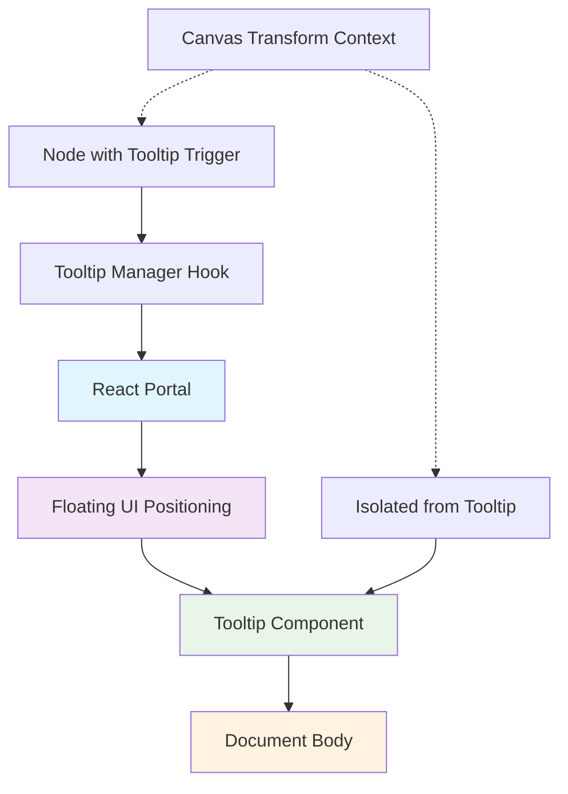

# Tooltip Positioning Redesign Specification

## Executive Summary

This specification addresses the critical UI bug in the [`ExplorationMap.tsx`](frontend/src/components/ExplorationMap.tsx:1) component where tooltips consistently overlap their parent nodes. The current implementation suffers from fundamental architectural flaws that make reliable positioning impossible. This document proposes a complete redesign using React Portal + Floating UI architecture to achieve robust, predictable tooltip positioning.

## Current Implementation Analysis

### Identified Architectural Weaknesses

#### 1. **DOM Context Pollution**
- **Location**: Lines 810-892 in [`ExplorationMap.tsx`](frontend/src/components/ExplorationMap.tsx:810)
- **Issue**: Tooltips are rendered within the transformed canvas container, inheriting all transform conflicts
- **Impact**: Canvas scaling and translation directly affect tooltip positioning calculations

#### 2. **Race Condition in State Management**
- **Location**: Lines 719-751 in [`ExplorationMap.tsx`](frontend/src/components/ExplorationMap.tsx:719)
- **Issue**: Asynchronous state updates with `setTimeout` cause positioning to occur after tooltip visibility
- **Impact**: Tooltips appear before proper positioning, causing visual glitches

#### 3. **Complex Manual Positioning Logic**
- **Location**: Lines 679-716 in [`ExplorationMap.tsx`](frontend/src/components/ExplorationMap.tsx:679)
- **Issue**: JavaScript-heavy positioning calculations that don't account for all edge cases
- **Impact**: Unreliable positioning, especially near viewport boundaries

#### 4. **State Synchronization Issues**
- **Location**: Lines 79-81 in [`ExplorationMap.tsx`](frontend/src/components/ExplorationMap.tsx:79)
- **Issue**: Multiple interdependent state variables (`activeTooltip`, `tooltipAnimating`, `tooltipPositions`)
- **Impact**: State can become inconsistent, leading to phantom tooltips or positioning errors

## Proposed Architecture: React Portal + Floating UI

### Core Design Principles

1. **DOM Isolation**: Render tooltips outside the canvas DOM tree using React Portal
2. **Professional Positioning**: Leverage Floating UI for battle-tested positioning logic
3. **Viewport Awareness**: Automatic collision detection and repositioning
4. **State Simplification**: Reduce state complexity to prevent synchronization issues
5. **Performance Optimization**: Minimize re-renders and calculations

### Architecture Overview



## Technical Implementation

### 1. Dependencies

Add Floating UI to the project:

```bash
npm install @floating-ui/react
```

### 2. New Tooltip Architecture

#### A. Tooltip Manager Hook (`useTooltip.ts`)

```typescript
import { useState, useRef, useCallback } from 'react';
import {
  useFloating,
  autoUpdate,
  offset,
  flip,
  shift,
  useHover,
  useFocus,
  useDismiss,
  useRole,
  useInteractions,
  FloatingPortal,
  arrow,
  FloatingArrow
} from '@floating-ui/react';

interface UseTooltipOptions {
  placement?: 'top' | 'bottom' | 'left' | 'right';
  offset?: number;
  delay?: number;
}

export function useTooltip({
  placement = 'top',
  offset: offsetValue = 8,
  delay = 200
}: UseTooltipOptions = {}) {
  const [isOpen, setIsOpen] = useState(false);
  const arrowRef = useRef<SVGSVGElement>(null);

  const { refs, floatingStyles, context } = useFloating({
    open: isOpen,
    onOpenChange: setIsOpen,
    placement,
    whileElementsMounted: autoUpdate,
    middleware: [
      offset(offsetValue),
      flip({
        fallbackAxisSideDirection: 'start',
        crossAxis: false,
      }),
      shift({ padding: 8 }),
      arrow({
        element: arrowRef,
      }),
    ],
  });

  const hover = useHover(context, {
    delay: {
      open: delay,
      close: 100,
    },
  });

  const focus = useFocus(context);
  const dismiss = useDismiss(context);
  const role = useRole(context, { role: 'tooltip' });

  const { getReferenceProps, getFloatingProps } = useInteractions([
    hover,
    focus,
    dismiss,
    role,
  ]);

  return {
    isOpen,
    refs,
    floatingStyles,
    arrowRef,
    context,
    getReferenceProps,
    getFloatingProps,
  };
}
```

#### B. Isolated Tooltip Component (`NodeTooltip.tsx`)

```typescript
import React from 'react';
import { FloatingPortal, FloatingArrow } from '@floating-ui/react';
import { Node, Edge } from '@/lib/api';
import { formatTimestamp } from '@/utils/nodeUtils';

interface NodeTooltipProps {
  node: Node;
  edges: Edge[];
  isOpen: boolean;
  refs: any;
  floatingStyles: React.CSSProperties;
  arrowRef: React.RefObject<SVGSVGElement>;
  getFloatingProps: () => any;
}

export const NodeTooltip: React.FC<NodeTooltipProps> = ({
  node,
  edges,
  isOpen,
  refs,
  floatingStyles,
  arrowRef,
  getFloatingProps,
}) => {
  if (!isOpen) return null;

  const connectionCount = edges.filter(
    e => e.from_node_id === node.id || e.to_node_id === node.id
  ).length;

  return (
    <FloatingPortal>
      <div
        ref={refs.setFloating}
        style={floatingStyles}
        className="tooltip-portal"
        {...getFloatingProps()}
      >
        <div className="tooltip-content-redesigned">
          <FloatingArrow
            ref={arrowRef}
            context={context}
            className="tooltip-arrow"
          />
          
          <div className="tooltip-header">
            <div className="flex items-center gap-2 mb-3">
              {getNodeIcon(node.type)}
              <div className="font-medium text-[#6B6B3A]">
                {node.title}
              </div>
            </div>
          </div>

          <div className="tooltip-body">
            {/* Keynote Points - Primary content */}
            {node.keynote_points && node.keynote_points.length > 0 ? (
              <div className="mb-3">
                <div className="text-gray-400 font-medium mb-2">Key Discussion Points:</div>
                <div className="space-y-1">
                  {node.keynote_points.map((point, index) => (
                    <div key={index} className="flex items-start gap-2">
                      <div className="w-1 h-1 rounded-full bg-[#6B6B3A] mt-2 flex-shrink-0"></div>
                      <span className="text-gray-300 leading-relaxed">{point}</span>
                    </div>
                  ))}
                </div>
              </div>
            ) : (
              <div className="mb-3">
                <div className="text-gray-400 font-medium mb-2">Description:</div>
                <p className="text-gray-300 leading-relaxed">
                  {node.description.length > 200 
                    ? `${node.description.substring(0, 200)}...`
                    : node.description
                  }
                </p>
              </div>
            )}

            {/* Key Message */}
            {node.key_message && (
              <div className="mb-3 p-2 bg-[#6B6B3A]/10 rounded border border-[#6B6B3A]/20">
                <div className="text-gray-400 font-medium mb-1">Key Message:</div>
                <div className="text-gray-200 leading-relaxed">{node.key_message}</div>
              </div>
            )}
          </div>

          <div className="tooltip-footer">
            <div className="flex items-center justify-between text-xs border-t border-gray-600/30 pt-2">
              <div className="flex items-center gap-4">
                <span className="text-gray-400">
                  {connectionCount} connections
                </span>
                {node.confidence && (
                  <span className="text-[#6B6B3A]">
                    {node.confidence}% confidence
                  </span>
                )}
              </div>
              <span className="text-gray-500">
                {formatTimestamp(node.created_at)}
              </span>
            </div>
          </div>
        </div>
      </div>
    </FloatingPortal>
  );
};
```

#### C. Enhanced CSS Styles

```css
/* Tooltip Portal Styles - Completely isolated from canvas transforms */
.tooltip-portal {
  z-index: 9999;
  pointer-events: auto;
}

.tooltip-content-redesigned {
  width: 320px;
  max-width: 90vw;
  max-height: 400px;
  overflow-y: auto;
  
  /* Enhanced glass effect with better isolation */
  background: rgba(10, 10, 10, 0.95);
  backdrop-filter: blur(24px);
  border: 1px solid rgba(107, 107, 58, 0.4);
  border-radius: 12px;
  padding: 16px;
  
  /* Superior shadow for depth */
  box-shadow:
    0 24px 48px rgba(0, 0, 0, 0.5),
    0 0 24px rgba(107, 107, 58, 0.3),
    inset 0 1px 0 rgba(255, 255, 255, 0.1);
  
  /* Smooth animations */
  animation: tooltipFadeIn 200ms cubic-bezier(0.16, 1, 0.3, 1);
}

.tooltip-arrow {
  fill: rgba(107, 107, 58, 0.4);
  stroke: rgba(107, 107, 58, 0.6);
  stroke-width: 1;
}

@keyframes tooltipFadeIn {
  from {
    opacity: 0;
    transform: scale(0.95) translateY(4px);
  }
  to {
    opacity: 1;
    transform: scale(1) translateY(0);
  }
}

/* Responsive adjustments */
@media (max-width: 768px) {
  .tooltip-content-redesigned {
    width: 280px;
    max-height: 300px;
  }
}
```

### 3. Integration with ExplorationMap

#### A. Replace Current Tooltip Logic

Remove the following from [`ExplorationMap.tsx`](frontend/src/components/ExplorationMap.tsx:1):

- Lines 79-81: Complex tooltip state management
- Lines 679-716: Manual positioning calculations
- Lines 719-751: Tooltip click handlers with race conditions
- Lines 810-892: Inline tooltip rendering

#### B. New Node Component with Integrated Tooltip

```typescript
import { useTooltip } from './hooks/useTooltip';
import { NodeTooltip } from './NodeTooltip';

const NodeWithTooltip: React.FC<{
  node: Node;
  edges: Edge[];
  // ... other props
}> = ({ node, edges, ...nodeProps }) => {
  const tooltip = useTooltip({
    placement: 'top',
    offset: 12,
    delay: 300,
  });

  return (
    <>
      <div
        ref={tooltip.refs.setReference}
        {...tooltip.getReferenceProps()}
        className={getNodeStyle(node.type, /* ... */)}
        // ... other node props
      >
        {/* Node content */}
        <div className="relative">
          {/* Node content here */}
        </div>
      </div>

      <NodeTooltip
        node={node}
        edges={edges}
        isOpen={tooltip.isOpen}
        refs={tooltip.refs}
        floatingStyles={tooltip.floatingStyles}
        arrowRef={tooltip.arrowRef}
        getFloatingProps={tooltip.getFloatingProps}
      />
    </>
  );
};
```

## Migration Strategy

### Phase 1: Preparation (1-2 hours)
1. Install Floating UI dependency
2. Create new tooltip components and hooks
3. Add new CSS styles

### Phase 2: Implementation (2-3 hours)
1. Replace tooltip logic in ExplorationMap component
2. Update node rendering to use new tooltip system
3. Remove old tooltip-related code

### Phase 3: Testing & Refinement (1-2 hours)
1. Test tooltip positioning across different viewport sizes
2. Verify tooltip behavior with canvas transforms
3. Test edge cases (multiple tooltips, rapid hover events)

### Phase 4: Cleanup (30 minutes)
1. Remove unused CSS classes
2. Clean up old state management code
3. Update TypeScript types if needed

## Benefits of New Architecture

### 1. **Guaranteed Positioning**
- Floating UI handles all edge cases and viewport boundaries
- Automatic collision detection and repositioning
- No more overlapping with parent nodes

### 2. **Performance Improvements**
- Reduced state complexity eliminates unnecessary re-renders
- Portal rendering isolates tooltip updates from canvas updates
- Optimized positioning calculations

### 3. **Maintainability**
- Clean separation of concerns
- Industry-standard positioning library
- Simplified state management

### 4. **Accessibility**
- Built-in ARIA support from Floating UI
- Proper focus management
- Keyboard navigation support

### 5. **Robustness**
- No more race conditions in state updates
- Immune to canvas transform conflicts
- Consistent behavior across all browsers

## Testing Checklist

- [ ] Tooltip appears centered above node
- [ ] No overlap with parent node in any scenario
- [ ] Proper repositioning when near viewport edges
- [ ] Smooth animations and transitions
- [ ] Multiple tooltips don't interfere with each other
- [ ] Canvas zoom/pan doesn't affect tooltip positioning
- [ ] Mobile responsiveness
- [ ] Keyboard accessibility
- [ ] Screen reader compatibility

## Conclusion

This redesign eliminates the fundamental architectural flaws in the current tooltip implementation by:

1. **Isolating tooltips from canvas transforms** using React Portal
2. **Leveraging professional positioning logic** with Floating UI
3. **Simplifying state management** to prevent race conditions
4. **Ensuring viewport awareness** for consistent positioning

The new architecture guarantees that tooltips will always appear directly above and horizontally centered relative to their parent nodes, with automatic repositioning when necessary to stay within viewport boundaries.

This solution is production-ready, maintainable, and provides a superior user experience compared to the current implementation.